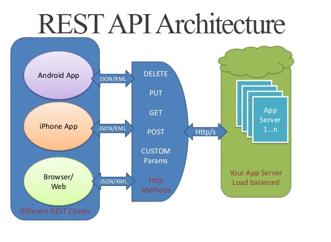

# API REST

---

## Què és una _API_ ?

Una _**API**_ ( _**Application Programming Interface**_ ), o Interfície de Programació d'Aplicacions, és un conjunt de rutines que proveeix accés a funcions d'un determinat programari _software_ . els nostres llocs i aplicacions _web_ .

Dins dels navegadors _web_ tenim 2 tipus de _APIs_ :

1.  **_APIs_ natives** , com el _DOM_ que és el _API_ que ens permet accedir al codi _HTML_ dels nostres documents a través de _JavaScript_ o la de Geolocalització que no permet accedir a les coordenades terrestres de la nostra ubicació actual; i,
2.  **_APIs_ externes** , com la de _Twitter_ que ens permet obtenir els darrers tweets d'un usuari, o la de _GitHub_ que ens permet obtenir la informació dels repositoris d'un compte o com _API_ de _WordPress_ que ens permet accedir a la informació de pàgines i entrades d'un lloc.

La majoria de _APIs_ externes del desenvolupament _web_ actual , funcionen amb l'Arquitectura _**REST**_ .

## Què és _REST_ ?

El terme _**REST**_ ( _**Representational State Transfer**_ ) o Transferència d'Estat Representacional, es va originar l'any 2000, descrit a la [tesi](https://es.wikipedia.org/wiki/Transferencia_de_Estado_Representacional) de _Roy Fielding_ , pare de l'especificació _HTTP_ .

Un servei _**REST**_ és un conjunt de restriccions amb què podem crear un estil d'arquitectura de _programari_ , la qual podrem fer servir per crear aplicacions _web_ respectant el protocol _HTTP_ .

Avui dia la majoria de les empreses utilitzen _**API REST**_ per crear serveis. Això és perquè és un estàndard lògic i eficient per a la creació de serveis _web_ .

Segons _Fielding_ les restriccions que defineixen un sistema _**API REST**_ o _**RESTful**_ com també se'l coneix, són:

- **Client-Servidor** , aquesta restricció manté el client i el servidor feblement acoblats. Això vol dir que el client no necessita conèixer els detalls d'implementació del servidor i el servidor s'oblida d'entendre com es fan servir les dades que envia al client.
- **Sense Estat** significa que cada petició rebuda pel servidor hauria de ser independent, és a dir, no cal mantenir sessions.
- **Cacheable** , ha d'admetre un sistema d'emmagatzematge a _cache_ , cosa que evitarà repetir diverses connexions entre el servidor i el client per recuperar un mateix recurs.
- **Interfície Uniforme** , significa una interfície genèrica per administrar cada interacció que es produeixi entre el client i el servidor de manera uniforme, la qual cosa simplifica i separa l'arquitectura. Aquesta restricció indica que cada recurs del servei _**REST**_ ha de tenir una única adreça ( _URL_ ) _web_ , a aquestes rutes se'ls dóna el nom de _**endpoints**_ .
- **Sistema de Capes** , el servidor pot disposar de diverses capes per a la seva implementació. Això ajuda a millorar l'escalabilitat, el rendiment i la seguretat.

Si creeu aplicacions _web_ amb _JavaScript_ , les API REST probablement seran la forma principal d'obtenir dades per a les vostres aplicacions, així com la d'enviar dades cap a una base de dades. Podem dir que són el nou **CRUD** del desenvolupament modern, amb l'avantatge que pots separar la teva lògica del teu client de la del servidor i la base de dades.

| Operacions _CRUD_ | Peticions _REST_ |
| :---------------: | :--------------: |
|     _INSERT_      |      _POST_      |
|     _SELECT_      |      _GET_       |
|     _UPDATE_      |      _PUT_       |
|     _DELETE_      |     _DELETE_     |

Un altre avantatge d'aquest model de desenvolupament és que podeu utilitzar un mateix origen de dades per a diferents clients, per exemple un client nadiu ( _iOS_ , _Android_ ), un client d'escriptori ( _Windows_ ) o un client _web_ (Navegadors).

