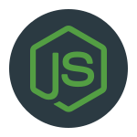

Node.js
=======

* * *

Introducció
-----------

### Què és _Node.js_ ?

> _Node.js_ ® és un entorn d'execució per a _JavaScript_ construït amb el motor de , és l'ecosistema més gran de llibreries de codi obert al món. _npm_ , _Node.js_ sense bloqueig i orientat a esdeveniments, que ho fa lleuger i eficient. L'ecosistema de paquets de _E/S_ utilitza un model d'operacions _Node.js_ . _Chrome_ de _V8_ _JavaScript_
> 
> *   [Node.js](https://nodejs.org/) .

_Node.js_ és un entorn d'execució de codi obert basat en el motor de _JavaScript_ _V8_ de _Google Chrome_ . Permet als desenvolupadors executar codi _JavaScript_ fora del navegador _web_ , cosa que significa que podeu utilitzar _JavaScript_ per construir aplicacions al costat del servidor. Va ser creat per _Ryan Dahl_ el 2009 i des de llavors s'ha convertit en una tecnologia àmpliament adoptada i popular al món del desenvolupament _web_ .

### Història

La història de _Node.js_ comença el 2009 quan _Ryan Dahl_ , un enginyer de _programari_ , va presentar per primera vegada _Node.js_ a l'esdeveniment " _JSConf EU_ " a Berlín. La idea darrere _Node.js_ va sorgir de la frustració de _Dahl_ amb els servidors tradicionals que utilitzaven el model de fils, que sovint resultava en un rendiment deficient i problemes d'escalabilitat.

_Ryan Dahl_ volia construir un entorn de servidor que pogués manejar múltiples sol·licituds concurrents de manera eficient i escalable. Per aconseguir això, va triar utilitzar el motor _V8 de Google Chrome_ , que és un motor de _JavaScript_ d'alt rendiment. _Dahl_ va desenvolupar una capa de xarxa i _E/S_ sobre el motor utilitzant el llenguatge de programació _C++_ , i el va anomenar " _Node.js_ ".

Va ser llançat oficialment el 2009 i el seu enfocament a l'asincronia i el model no bloquejant el va fer popular ràpidament entre els desenvolupadors. La comunitat de _Node.js_ va començar a créixer i aportar biblioteques i mòduls addicionals a través de _NPM_ ( _Node Package Manager_ ), que es va convertir en el gestor de paquets estàndard per a _Node. js_ .

En els anys següents, _Node.js_ va continuar evolucionant i guanyant popularitat. Grans empreses com _LinkedIn_ , _PayPal_ , _Netflix_ i _Walmart_ ho van adoptar per a les seves aplicacions i serveis, la qual cosa va contribuir al seu creixement i acceptació en la indústria.

El 2015, va fer un important pas cap a la maduresa amb la convergència de dos projectes que havien sorgit anteriorment: _Node.js_ i , que va incloure característiques i millores significatives. _Node.js v4_ " per consolidar esforços i unificar la comunitat. Això va portar a la creació de _Node.js Foundation_ . Tots dos projectes van treballar junts sota la iniciativa " _io.js_

Des d'aleshores, _Node.js_ ha seguit millorant i llançant noves versions de manera regular. Ha continuat sent una tecnologia popular per al desenvolupament d'aplicacions _web_ , serveis en temps real, aplicacions d'Internet de les coses ( _IoT_ ) i més. La comunitat activa de desenvolupadors, les constants millores de rendiment i l'àmplia adopció a la indústria asseguren que _Node.js_ continuarà sent una eina rellevant i poderosa per al desenvolupament en el futur.

### Isomorfisme amb _JavaScript_

L'isomorfisme és una tècnica de programació que permet executar el mateix codi al costat del client i al costat del servidor.

Avui _JavaScript_ , és l'únic llenguatge de programació capaç d'executar-se a les 3 capes del desenvolupament que té una aplicació web :

1.  Al **_Frontend_** amb el _JavaScript_ de tota la vida, el dels navegadors.
2.  Al **_Backend_** amb entorns de programació com [_Node.js_](https://nodejs.org/) , [_Dé_](https://deno.land/) o [_Bun_](https://bun.sh/) .
3.  En la **Persistencia de dades** amb gestors de bases de dades Mysql, NoSQL com _MongoDB_ , _Couch DB_ Firebase , etc.

Fins i tot avui amb _JavaScript_ gràcies al vostre entorn _Node.js_ podem controlar dispositius de _Hardware_ i _IoT_ com a controladors i , electrodomèstics i més. , robots, drones, _Arduíno_

_Node.js_ en aquests contextos de desenvolupament.

#### _Node.js_ en el _Frontend_ :

En el context del desenvolupament _Frontend_ , _Node.js_ té diversos usos importants:

1.  **Execució de tasques a l'entorn de desenvolupament:** És útil per executar tasques i _scripts_ durant el procés de desenvolupament _frontend_ . Per exemple, es pot utilitzar per compilar fitxers _CSS_ i _JavaScript_ , optimitzar imatges, concatenar fitxers, minificar codi, i altres tasques comunes que milloren el rendiment i l'eficiència d'una aplicació _web_ .
2.  **Manejament de paquets i dependències:** Juntament amb _NPM_ ( _Node Package Manager_ ), és àmpliament utilitzat per gestionar dependències i paquets al _frontend_ . Amb NPM, els desenvolupadors poden instal·lar i administrar llibreries i _frameworks_ de _JavaScript_ que s'utilitzen al frontend del projecte.
3.  **Entorn de construcció ( _build environment_ ):** Pot ser utilitzat com un entorn de construcció per a aplicacions _frontend_ . És especialment comú en projectes que utilitzen _frameworks_ de _frontend_ com a > _React_ , _Veu.js_ o _Angular_ i tasques per compilar, empaquetar i optimitzar el codi abans de desplegar-lo en producció. _scripts_ , on es poden configurar
4.  **Desenvolupament d'eines _frontend_ :** Permet als desenvolupadors crear eines i utilitats que faciliten el desenvolupament _linters_ , i altres utilitats per millorar la qualitat i la productivitat de l'equip de desenvolupament. (plantilles de projecte), _scaffolding_ . Per exemple, es poden construir eines de generació de codi, _frontend_
5.  **Servidors de desenvolupament locals:** En utilitzar _Node.js_ , els desenvolupadors poden configurar servidors de desenvolupament locals per provar la vostra aplicació frontend abans de desplegar-la en un servidor de producció. Això els permet treballar en un entorn segur i controlat, i fer canvis en temps real sense haver de dependre d'un servidor extern.
6.  **Proves i automatització:** És àmpliament utilitzat en el desenvolupament _frontend_ per realitzar proves unitàries, proves de integració i proves _end-to-end_ . A més, es pot utilitzar per automatitzar tasques de prova, cosa que permet als desenvolupadors detectar i solucionar problemes ràpidament.
7.  **_Server-Side Rendering_ ( _SSR_ ):** Alguns _frameworks_ de _frontend_ , com _React_ i _Veu.js_ , permeten el _Server Side Rendering_ completament renderitzada al client, cosa que millora el rendiment i l'experiència de l'usuari. _HTML_ al servidor i enviar una pàgina _frameworks_ és essencial per habilitar aquest procés, ja que podeu executar el codi d'aquests _Node.js_ (renderitzat del costat del servidor).

#### _Node.js_ en el _Backend_ :

En el context del desenvolupament _Backend_ , _Node.js_ té diversos usos importants:

1.  **Basat en _JavaScript_ :** Utilitza el mateix llenguatge de programació, _JavaScript_ , tant al costat del client (navegador) com al costat del servidor ( _Node.js_ ). Això permet als desenvolupadors utilitzar les mateixes habilitats i eines en tots dos entorns.
2.  **Asíncron i No bloquejant:** Utilitza un model d'entrada/sortida sense bloqueig i basat en esdeveniments, cosa que permet a les aplicacions manejar múltiples sol·licituds i operacions simultàniament sense esperar que una operació acabi abans de passar a la següent.
3.  **Eficient i Ràpid:** Gràcies a la seva arquitectura no bloquejant, és molt eficient i escalable, cosa que el fa adequat per a aplicacions en temps real i d'alt rendiment.
4.  **Escalabilitat:** Es va dissenyar des del principi amb l'escalabilitat al cap. El seu enfocament en l'assincronia i l'eficiència permet que les aplicacions creades escalin fàcilment per gestionar més càrrega de treball sense augmentar significativament els recursos del servidor.
5.  **Àmplia comunitat i ecosistema:** Compta amb una gran comunitat de desenvolupadors i una àmplia varietat de biblioteques i paquets disponibles a través de _NPM_ ), cosa que facilita la construcció d'aplicacions amb funcionalitats avançades i reutilitzables. _Node Package Manager_ (
6.  **Manejament de sol·licituds HTTP:** Inclou un mòdul `http` que permet crear fàcilment servidors web i manejar sol·licituds i respostes _HTTP_ , cosa que el fa ideal per al desenvolupament d'aplicacions _web_ i _APIs_ .
7.  **Multi Plataforma:** És compatible amb múltiples sistemes operatius, com _Windows_ ,macOS i _Linux_ , cosa que facilita la portabilitat de les aplicacions desenvolupades en aquest entorn. a>
8.  **Ús del mateix llenguatge al client i al servidor:** En utilitzar _JavaScript_ tant al costat del client com al servidor. Això simplifica el desenvolupament per a aquells que ja estan familiaritzats amb aquest llenguatge, ja que poden utilitzar les mateixes habilitats i coneixements a banda i banda, cosa que redueix la corba d'aprenentatge.
9.  **Ideal per a aplicacions en temps real:** Gràcies al seu model no bloquejant i la seva capacitat per manejar moltes connexions simultànies, _Node.js_ , jocs en línia, aplicacions de col·laboració i sistemes de notificacions.< /span> _xats_ és especialment adequat per a aplicacions en temps real, com ara

Aquestes característiques i avantatges fan de _Node.js_ una opció popular i poderosa per desenvolupar aplicacions _web_ i servidors moderns i eficients. El seu ecosistema vibrant i en constant creixement el converteix en una tecnologia atractiva per a desenvolupadors de tot el món.

#### _Node.js_ a les bases de dades:

_Node.js_ té diversos usos importants en el context de treballar amb bases de dades:

1.  **Connexió i consultes a bases de dades:** _Node.js_ permet establir connexions amb diferents sistemes de bases de dades, tant relacionals com no relacionals , per exemple _MySQL_ , _PostgreSQL_ , _MongoDB_ , _Redis_ , entre d'altres. Utilitzant biblioteques i _drivers_ específics per a cada base de dades, _Node.js_ pot fer consultes, insercions, actualitzacions i eliminacions de dades de manera eficient.
2.  **Desenvolupament d'APIs per a accés a dades:** Es poden crear _APIs_ Application Programming Interfaces ) que actuïn com a intermediaris per a l'accés i la manipulació de dades en una base de dades. Aquestes _APIs_ poden ser utilitzades per aplicacions client, tant al _frontend_ com en altres serveis al backend, per accedir i gestionar dades emmagatzemades a la base de dades.
3.  **_Middleware_ per a la manipulació de dades:** En aplicacions web, _Node.js_ pot actuar com un _middleware_ per realitzar tasques de validació, transformació i processament de dades abans de desar-les o recuperar-les de la base de dades. Això ajuda a mantenir la lògica de negoci separada de l'accés directe a la base de dades i permet més modularitat i reutilització de codi.
4.  **Catxeig i emmagatzematge en memòria cau de dades:** Es pot utilitzar per implementar estratègies de memòria cau, on les dades freqüentment accedides s'emmagatzemen en memòria o en bases de dades ràpides com . Això redueix la càrrega a la base de dades principal i millora significativament el rendiment de l'aplicació, especialment en aplicacions amb moltes sol·licituds concurrents. _Redis_
5.  **Processament de dades en temps real:** És ideal per a aplicacions que requereixen processament de dades en temps real, com ara anàlisi de dades en viu, actualització de dades, notificacions, etc. Com que és asincrònic i no bloquejant, podeu gestionar grans quantitats de dades i tasques en temps real de manera eficient.
6.  **Migracions i canvis a l'estructura de la base de dades:** Amb _Node.js_ , es poden crear _scripts_ per realitzar migracions a la base de dades, cosa que permet realitzar canvis en l'estructura de la base de dades de manera controlada i sense afectar la integritat de les dades existents.
7.  **Integració amb bases de dades externes i serveis:** Es pot integrar fàcilment amb serveis i bases de dades externes a través de _APIs_ o serveis _web_ . Això permet la comunicació amb altres aplicacions i sistemes per accedir i compartir dades de manera segura.

En general, _Node.js_ és una eina valuosa per treballar amb bases de dades, ja que proporciona una plataforma eficient i flexible per al accés, manipulació i gestió de dades, fet que contribueix a la construcció d'aplicacions _backend_ més eficients, escalables i en temps real.

#### _Node.js_ amb el _Maquinari_

_Node.js_ també té aplicacions interessants en temes de _hardware_ , permetent als desenvolupadors interactuar amb dispositius físics i utilitzar el poder de JavaScript per controlar i manipular maquinari en diferents contextos. Aquí hi ha algunes àrees on s'utilitza:

1.  **Internet de les coses ( _IoT_ ):** És una elecció popular per desenvolupar aplicacions i prototips de _IoT_ . La seva naturalesa asíncrona i no bloquejant el fa ideal per interactuar amb sensors i actuadors en dispositius _IoT_ . Podeu comunicar-vos amb dispositius connectats a través de ports _GPIO_ ( _General Purpose Input/Output_ ), _UART_ ( _Universal Asynchronous Receiver/Transmitter_ ), i altres protocols de comunicació, permetent als dispositius enviar i rebre dades.
2.  **Robots i Drons:** S'ha utilitzat per controlar robots i drones. La capacitat de manejar múltiples tasques en temps real el converteix en una opció atractiva per a aplicacions robòtiques. Podeu interactuar amb sensors, motors i altres components per controlar el moviment i realitzar accions específiques.
3.  **Automatització de la llar:** S'utilitza en projectes d'automatització de la llar, on es poden connectar i controlar dispositius electrònics, electrodomèstics, il·luminació i altres dispositius intel·ligents a través d'interfícies o aplicacions mòbils. _web_
4.  **Impressores _3D_ :** S'ha utilitzat per controlar impressores _3D_ . Podeu enviar ordres d'impressió mitjançant un port serial o una connexió de xarxa per controlar el procés d'impressió i monitoritzar l'estat de la impressora.
5.  **Servidors per a dispositius encastats:** _Node.js_ és una opció viable per implementar servidors en dispositius encastats amb recursos limitats. La seva petjada lleugera i la seva eficiència el fan adequat per manejar sol·licituds de xarxa i controlar la comunicació amb altres dispositius.
6.  **Realitat Virtual i Realitat Augmentada:** S'utilitza per construir aplicacions en temps real que interactuen amb dispositius de realitat virtual i augmentada. Podeu processar dades en temps real de sensors i càmeres per proporcionar experiències immersives.
7.  **_Hardware_ de prototipat i proves:** És útil per al prototipat ràpid i proves de concepte en temes de _hardware_ . Els desenvolupadors poden crear fàcilment interfícies per interactuar amb diferents components i avaluar la viabilitat de noves idees i projectes.

En resum, _Node.js_ proporciona una plataforma versàtil i eficient per interactuar amb maquinari, des de dispositius petits i embeguts fins a robots, drones, i aplicacions de _IoT_ . El seu enfocament a l'assincronia i el desenvolupament ràpid ho fa una opció popular per a projectes que impliquen controlar i monitoritzar dispositius físics.

* * *

Instal·lació
------------

### Tipus d'instal·lació

Node.js ofereix diferents tipus d'instal·lació per adaptar-se a les necessitats i les preferències dels usuaris. Els tipus d'instal·lació més comuns són:

1.  **Instal·lació Binària ( _Binary_ ):** Aquesta és la manera més senzilla d'instal·lar _Node.js_ i és adequada per a la majoria dels usuaris. Consisteix a descarregar un instal·lador precompilat específic per al sistema operatiu i l'arquitectura de l'usuari. Els instal·ladors binaris estan disponibles per a _Windows_ , _macOS_ i diverses distribucions de . Només cal descarregar el fitxer de l'instal·lador i seguir l'assistent d'instal·lació per completar el procés. _Linux_
2.  **Instal·lació a través del Gestor de Paquets del Sistema ( _Package Manager_ ):** Alguns sistemes operatius i distribucions de _Linux_ ofereixen _Node.js_ als seus repositoris i permeten instal·lar-lo mitjançant el gestor de paquets del sistema. Per exemple, en sistemes basats en _Debian/Ubuntu_ , es pot instal·lar _Node.js_ usant `apt` , i en sistemes basats en _Fedora/RHEL_ , es pot instal·lar usant < a i=15> o . Aquesta opció és convenient per a aquells que prefereixen utilitzar les eines de gestió de paquets natives del sistema. `dnf` `yum`
3.  **Instal·lació des del codi font ( _Source_ ):** Aquesta opció és menys comú i s'utilitza generalment per desenvolupadors avançats o per personalitzar la instal·lació de _Node.js_ en sistemes operatius que no tenen un instal·lador binari disponible. Consisteix a descarregar el codi font des del repositori oficial de _GitHub_ , compilar-lo i configurar el sistema manualment.
4.  **Control de versions amb _NVM_ ( _Node Version Manager_ ):** _NVM_ és una eina que permet instal·lar i administrar múltiples versions de _Node.js_ al mateix sistema. És útil quan necessites treballar amb diferents projectes que requereixen versions específiques. Es pot instal·lar en sistemes _UNIX_ , _macOS_ i fins i tot hi ha versió per a sense haver de desinstal·lar i instal·lar manualment. _Node.js_ i facilita el canvi entre versions de _Windows_

Les primeres tres opcions de la llista anterior es coneixen també com a instal·lació de tipus _Stand Alone_ ja que instal·lem una sola i única versió de , la capacitat de gestionar múltiples versions. _NVM_ , a diferència del que ens ofereix _Node.js_

És important esmentar que la manera d'instal·lar el Node.js pot variar segons el sistema operatiu i les preferències de l'usuari. Per obtenir instruccions detallades sobre com instal·lar Node.js en un sistema específic, és recomanable consultar la documentació oficial de Node.js o seguir les guies proporcionades per la comunitat de desenvolupament.

De qualsevol manera aquí et deixo un parell d'enllaços i vídeos que et serviran per instal·lar-lo:

*   Instal·lació _Stand Alone_ :
    *   [Lloc de descàrrega](https://nodejs.org/) .
*   Instal·lació amb _NVM_ :
    *   [_NVM_ per a _Linux/macOS_](https://github.com/nvm-sh/nvm) .
    *   [_NVM_ per a _Windows_](https://4geeks.com/es/how-to/como-instalar-nvm-en-windows) .

### Tipus de versions

_Node.js_ té dos tipus principals de versions:

1.  **Versions _LTS_ ( _Long Term Support_ )** té un cicle de suport de 30 mesos. Això proporciona als usuaris temps suficient per planificar i realitzar actualitzacions sense haver de bregar amb canvis freqüents. _LTS_ s'actualitza cada 6 mesos, i cada versió _Node.js LTS_ tenen suport a llarg termini, cosa que significa que rebran actualitzacions de seguretat i correccions d'errors durant un període més prolongat. _LTS_ Aquestes són les versions recomanades per a la majoria dels usuaris, especialment per a aplicacions i projectes en producció. Les versions
2.  **Versions _Current_ (Actuals):** Aquestes són les versions més recents de Node.js amb les últimes característiques i millores. Es llancen cada 6 mesos i tenen un cicle de suport més curt en comparació de les versions _LTS_ . Aquestes versions són ideals per a aquells usuaris que volen experimentar amb les darreres característiques i estar a l'avantguarda de la tecnologia. Tot i això, no es recomanen per a entorns de producció crítics a causa del seu cicle de vida més curt i la possibilitat de canvis més freqüents.

És important tenir en compte que l'elecció de la versió de Node.js depèn del tipus de projecte i les vostres necessitats específiques. Si esteu iniciant un nou projecte, és recomanable utilitzar la darrera versió _LTS_ , ja que brindarà una major estabilitat i suport a llarg termini. D'altra banda, si ja tens un projecte en producció que utilitza una versió _LTS_ més antiga, és possible que vulguis mantenir aquesta versió i planificar una actualització a la següent versió _LTS_ en el futur.

### Verificant la instal·lació

Una vegada que es completi la instal·lació, podeu verificar si _Node.js_ i _NPM_ s'han instal·lat correctament obrint una finestra de terminal i escrivint les següents ordres:

    node -v
    
    npm -v

Si es mostren les versions de Node.js i NPM a la terminal, significa que la instal·lació va ser exitosa.

Si has decidit treballar amb _NVM_ , aquestes són les ordres que més utilitzaràs:

    // mostrar ajuda de nvm
    nvm --h
    
    // llistar versions disponibles a remot node que de node
    nvm list navailable
    // instal·lar vX.X.X de node amb nvm
    nvm install vX.X.X
    
    // per fer servir la versió vX.X.X de node amb nvm
    nvm use vX.X.X
    
    // per desinstal·lar la versió vX.X.X de node amb nvm
    nvm uninstall vX.X.X
    
    // assignar-la versió vX.X.X com default a nvm
    nvm alias default vX.X.X
    
    // per instal·lar json-serverde manera global;Tenir instal·lat Nodejs amb o sense nvm, (en els dos casos s'instal·la npm- Gestor de paquets de node)
    npm install -g json-server
    // per inicialitzar json-server;
    json-server --watch /ruta al directori de la bd/db.json
    
    json-server --watch -p 5000 ./ruta al directori de la bd/db.json
    //indicant el port
    
    

* * *